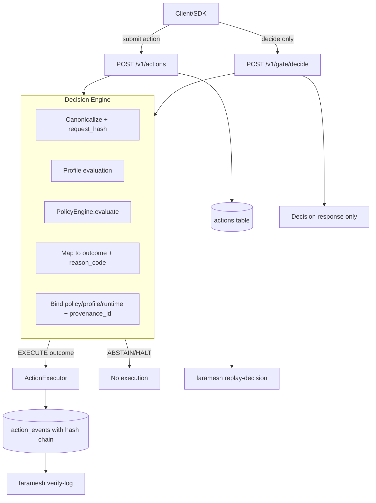

# Execution Gate & Tamper-Evident Audit

Faramesh v0.3.0 introduces a deterministic, fail-closed execution gate with version-bound decisions, execution profiles, and tamper-evident audit logging.

## Overview

The execution gate ensures that **no action can bypass governance**. Every action request passes through canonicalization, profile evaluation, and policy evaluation before any execution occurs.



## Key Concepts

### Decision Outcomes

| Outcome | Description | Action |
|---------|-------------|--------|
| **EXECUTE** | Action allowed to proceed | Executor runs the action |
| **ABSTAIN** | Requires human approval | Wait for approval decision |
| **HALT** | Action denied | No execution, logged for audit |

### Reason Codes

Machine-readable codes explain every decision:

| Code | Meaning |
|------|---------|
| `POLICY_ALLOW` | Policy rule explicitly allows |
| `POLICY_DENY` | Policy rule explicitly denies |
| `POLICY_REQUIRE_APPROVAL` | Policy requires human approval |
| `PROFILE_DISALLOWS_TOOL` | Tool not in profile allowlist |
| `DEFAULT_DENY_NO_MATCH` | No policy rule matched (default deny) |
| `INTERNAL_ERROR` | Internal error (fail-closed) |

## Deterministic Request Hashing

Every action payload is canonicalized to produce a deterministic `request_hash`:

- **Sorted keys**: Dict keys are sorted lexicographically
- **Normalized floats**: No exponents, no trailing zeros (1.0 → 1)
- **Fail-closed**: NaN, Infinity, and non-serializable types raise errors
- **Stable**: Identical logical payloads produce identical hashes

```python
from faramesh import compute_request_hash

payload = {
    "agent_id": "my-agent",
    "tool": "http",
    "operation": "get",
    "params": {"url": "https://example.com"},
    "context": {}
}

# Same hash regardless of key ordering
hash1 = compute_request_hash(payload)
hash2 = compute_request_hash({"context": {}, "params": {"url": "https://example.com"}, ...})
assert hash1 == hash2
```

## Gate Endpoint

The `POST /v1/gate/decide` endpoint evaluates a decision **without creating an action record**:

```bash
curl -X POST http://localhost:8000/v1/gate/decide \
  -H "Content-Type: application/json" \
  -d '{
    "agent_id": "my-agent",
    "tool": "http",
    "operation": "get",
    "params": {"url": "https://example.com"},
    "context": {}
  }'
```

Response:

```json
{
  "outcome": "EXECUTE",
  "reason_code": "POLICY_ALLOW",
  "reason": "HTTP GET allowed by policy",
  "request_hash": "abc123...",
  "policy_version": "default.yaml@2026-01-14T10:00:00",
  "policy_hash": "def456...",
  "profile_id": "default",
  "profile_version": "1.0.0",
  "profile_hash": "789abc...",
  "runtime_version": "0.3.0",
  "provenance_id": "xyz789..."
}
```

## Version-Bound Decisions

Every decision includes version-bound metadata for auditability:

| Field | Description |
|-------|-------------|
| `request_hash` | SHA-256 of canonicalized payload |
| `policy_hash` | SHA-256 of policy configuration |
| `profile_hash` | SHA-256 of execution profile |
| `runtime_version` | Faramesh version (e.g., "0.3.0") |
| `provenance_id` | Combined hash for replay verification |

## Execution Profiles

Profiles define tool allowlists and constraints:

```yaml
# profiles/default.yaml
id: default
version: "1.0.0"
allowed_tools:
  - http
  - shell
  - stripe
rules:
  - name: deny_dangerous_shell
    when:
      tool: shell
      operation: run
    pattern: "rm -rf|shutdown|reboot"
    outcome: HALT
    reason_code: PROFILE_DENY_DANGEROUS_SHELL
required_controls:
  approval_token: false
```

## Tamper-Evident Audit Log

All action events are hash-chained for tamper detection:

```json
{
  "id": "event-123",
  "action_id": "action-456",
  "event_type": "created",
  "prev_hash": "abc123...",
  "record_hash": "def456...",
  "created_at": "2026-01-14T10:00:00Z"
}
```

### Verify Audit Chain

```bash
# Verify audit chain for an action
faramesh verify-log <action-id>

# Output:
# ✓ Audit chain verified (5 events)
# All record_hash values are valid
```

## Decision Replay

Replay a decision to verify determinism:

```bash
# Replay by action ID
faramesh replay-decision <action-id>

# Output:
# Replaying decision for action abc123...
# Original: outcome=EXECUTE, reason_code=POLICY_ALLOW
# Replayed: outcome=EXECUTE, reason_code=POLICY_ALLOW
# ✓ Decision replay passed
```

If policy/profile has changed:

```bash
# Output:
# Replaying decision for action abc123...
# Original: outcome=EXECUTE, reason_code=POLICY_ALLOW
# Replayed: outcome=HALT, reason_code=POLICY_DENY
# ✗ Decision replay failed - policy_hash mismatch
```

## SDK Usage

### Python SDK

```python
from faramesh import gate_decide, execute_if_allowed, replay_decision

# Pre-check decision
decision = gate_decide("agent", "http", "get", {"url": "https://example.com"})
if decision.outcome == "EXECUTE":
    print("Action would be allowed")

# Execute only if allowed
result = execute_if_allowed(
    agent_id="agent",
    tool="http",
    operation="get",
    params={"url": "https://example.com"},
    executor=my_http_executor
)

# Verify decision replay
replay = replay_decision(action_id="abc123")
if replay.success:
    print("Decision is deterministic")
```

### Node.js SDK

```typescript
import { gateDecide, executeIfAllowed, replayDecision } from '@faramesh/sdk';

// Pre-check decision
const decision = await gateDecide("agent", "http", "get", { url: "https://example.com" });
if (decision.outcome === "EXECUTE") {
  console.log("Action would be allowed");
}

// Execute only if allowed
const result = await executeIfAllowed({
  agentId: "agent",
  tool: "http",
  operation: "get",
  params: { url: "https://example.com" },
  executor: myHttpExecutor
});

// Verify decision replay
const replay = await replayDecision({ actionId: "abc123" });
if (replay.success) {
  console.log("Decision is deterministic");
}
```

## Fail-Closed Semantics

The gate enforces **fail-closed** behavior:

- **Parse errors** → HALT with `REQUEST_PARSE_ERROR`
- **Schema errors** → HALT with `REQUEST_SCHEMA_INVALID`
- **Unknown fields** → HALT (Pydantic `extra="forbid"`)
- **Profile not found** → HALT with `PROFILE_NOT_FOUND`
- **Internal errors** → HALT with `INTERNAL_ERROR`

No action executes unless explicitly allowed.

## See Also

- [API Reference](API.md) - Complete API documentation
- [CLI Reference](CLI.md) - CLI commands including verify-log and replay-decision
- [Policies](Policies.md) - Policy configuration guide
- [SDK-Python](SDK-Python.md) - Python SDK with gate helpers
- [SDK-Node](SDK-Node.md) - Node.js SDK with gate helpers
