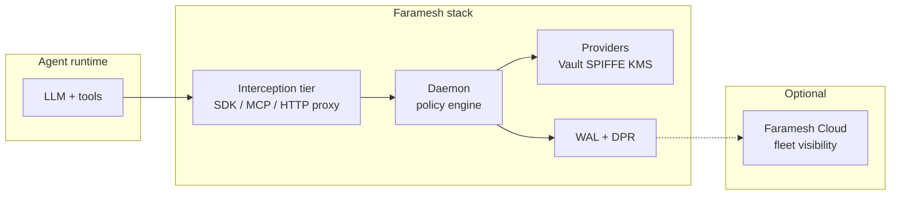

Faramesh splits **policy** (what should happen) from **enforcement** (what actually happens on each tool call). Your agent code stays familiar; the daemon sits on the enforcement path.

## Components

| Component | Role |
|-----------|------|
| **governance.fms** | Source of truth — agents, rules, imports, providers. |
| **CLI** | `check`, `plan`, `apply`, `dev`, `audit` — compile and operate the stack. |
| **Daemon** | Evaluates every tool call; never bypassed in enforce mode. |
| **Interception tier** | How calls reach the daemon (in-process shim, MCP proxy, HTTP proxy). |
| **Providers** | Sidecar binaries for secrets, identity, external KMS signing. |
| **WAL / DPR** | Hash-chained local audit; optional KMS signature on records. |
| **Faramesh Cloud** | Fleet UI, approvals, DPR replica — **not** in the enforcement path. |

## Interception tiers

| Tier | Best for |
|------|----------|
| SDK shim | LangGraph, LangChain, CrewAI, OpenAI Agents |
| MCP proxy | Claude Code, Cursor, other MCP clients |
| HTTP proxy | Bedrock, hosted vendor runtimes |
| A2A proxy | Multi-agent delegation |

See [Interception](/concepts/interception/) for selection guidance.

## Catalog artifacts (GitHub)

Imports resolve from [github.com/faramesh/faramesh-registry](https://github.com/faramesh/faramesh-registry):

- **Framework profiles** — FPL wiring for a runtime tier.
- **Policy packs** — reusable rules (Stripe, shell, GitHub, MCP, …).
- **Providers** — signed binaries downloaded at `faramesh apply`.

The CLI fetches from GitHub by default; no separate registry service is required.

## Trust boundaries

- The **daemon** is trusted for enforcement and audit integrity on the host.
- **Providers** are trusted only after signature verification against keys in `trust { ... }`.
- **Agents** are untrusted — tool arguments and model output are inputs to policy, not authority.

## Related

- [How Faramesh works](/concepts/how-it-works/)
- [Topologies](/concepts/topologies/)
- [Registry overview](/registry/overview/)
