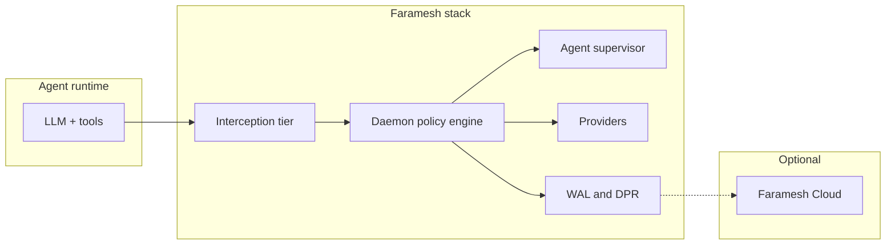

This page explains the **runtime architecture** of a Faramesh stack. What processes run, what they do, in what order, and where the trust boundaries are.

If you haven't read [How Faramesh works](/concepts/how-it-works/) yet, do that first. This page assumes you know the placement and the decision pipeline.

## Components at a glance



| Component | Process model | Role |
|-----------|---------------|------|
| **`governance.fms`** | File on disk | Source of truth: agents, rules, imports, providers. |
| **CLI (`faramesh`)** | Short-lived | `check`, `plan`, `apply`, `dev`, `audit`. Compiles and operates the stack. |
| **Daemon** | Long-lived process | Evaluates every tool call. Never bypassed in enforce mode. |
| **Interception tier** | In-process or daemon port | How calls reach the daemon (SDK shim / MCP proxy / HTTP proxy). |
| **Agent supervisor** | Threads inside the daemon | Spawns and supervises agent child processes under the OS sandbox. |
| **Providers** | Subprocesses launched by the daemon | Mint secrets, sign DPRs, ship audit records. |
| **WAL / DPR** | SQLite + append-only file | Hash-chained local audit; optional KMS signature. |
| **Faramesh Cloud** | External SaaS (optional) | Fleet UI, approvals, DPR replica. **Not** in the enforcement path. |

## 1. The daemon lifecycle

The daemon goes through explicit states. The Unix socket is **only** opened after the daemon is `READY`: early calls return `DAEMON_NOT_READY` instead of being silently evaluated against an incomplete policy.

```text title="Daemon lifecycle"
STARTING ──► INITIALIZING ──► READY ──► (running) ──► HALT
                  │                                    ▲
                  └──── on cold-start exceeded ────────┘
```

| State | What happens |
|-------|--------------|
| `STARTING` | Process is up; no I/O yet. |
| `INITIALIZING` | Open WAL, replay governance state, verify DPR chain, load policy, init providers, init telemetry. **Socket is not yet open.** |
| `READY` | Policy AST is loaded, providers verified, lifecycle marked ready. Socket starts listening. SDK calls are evaluated. |
| `HALT` | Cold-start budget exceeded, or fatal init error. Process exits non-zero. |

The window during which calls return `DAEMON_NOT_READY` is configurable:

```hcl title="governance.fms"
runtime {
  cold_start_deny_window = "5s"
}
```

Why this exists: if the daemon answered calls during init, the agent could race the policy load and slip through with the previous (or empty) AST. Faramesh fails closed.

→ See [Denial codes](/errors/) for the full `DAEMON_NOT_READY` payload.

## 2. The interception tiers in detail

The agent never reaches the real tool endpoint. There are three places where the call gets redirected to the daemon:

```text title="Interception"
                                ┌── SDK shim ──┐
                                │  (in-proc)   │
              ┌──── tier 1 ─────┘              │
              │                                ▼
   Agent ─────┤── tier 2 ───► MCP proxy ───► daemon
              │                  (port)        ▲
              │                                │
              └──── tier 3 ───► HTTP proxy ────┘
                                  (port)
```

Each tier has trade-offs documented in [Interception](/concepts/interception/). For untrusted agent code where bypass via direct SDK calls is a concern, combine the application tier with the **OS-tier sandbox** (next section).

## 3. The agent supervisor and OS-tier sandbox

This is the layer most product surfaces miss. When you set:

```hcl title="governance.fms"
runtime {
  os_tier                   = true
  strip_ambient_credentials = true
  agent_enforce_profile     = "full"      # full | minimal | off
  supervised_command        = "python agent.py"   # optional
}
```

Two new behaviors kick in.

### 3a. The generated launcher (`.faramesh/bin/agent`)

`faramesh apply` writes a small, deterministic launcher script into your stack:

```text title=".faramesh/bin/agent"
#!/bin/sh
# Generated by faramesh apply — do not edit.
. "$STACK_DIR/.faramesh/runtime/agent.env"
if [ "$FARAMESH_ENFORCE_PROFILE" = "off" ]; then exec "$@"; fi
exec "$FARAMESH_CLI" __agent-exec "$FARAMESH_ENFORCE_PROFILE" "$STACK_DIR" "$FARAMESH_PROXY_PORT" -- "$@"
```

You start your agent through the launcher:

```bash title="Terminal"
.faramesh/bin/agent -- python agent.py
```

The launcher:

1. Loads `.faramesh/runtime/agent.env` (socket path, agent id, enforce profile).
2. If `os_tier = true`, re-execs through `__agent-exec`, which applies the OS sandbox.
3. Strips ambient credential env vars if `strip_ambient_credentials = true`.
4. Sets `FARAMESH_AUTOLOAD=1` so the SDK auto-patches the framework.

There is **no separate `faramesh run` command**. The launcher is the single entry point; `governance.fms` is the only thing that drives its behavior.

### 3b. The daemon supervisor

When `runtime { supervised_command = "..." }` is set, the daemon **launches and supervises the agent child itself** after reaching `READY`. You don't need to remember to invoke the launcher. `faramesh apply` starts the daemon, and the daemon starts the agent.

```text title="Supervised lifecycle"
faramesh apply
   │
   ▼
daemon: STARTING → INITIALIZING → READY
                                    │
                                    ▼
                          agentSupervisor.Launch()
                                    │
                                    ▼
                        __agent-exec (sandbox)
                                    │
                                    ▼
                              agent process
                                    │
                                    ▼
                          (calls flow back through SDK shim)
```

The supervisor:

- Owns the child's PID and reaps on exit (logs and clears state).
- Applies the same OS sandbox that `.faramesh/bin/agent` would have.
- Strips ambient credentials before exec.
- Exposes `supervisor_launch`, `supervisor_stop`, `supervisor_list` over the SDK socket so external tooling (or a future operator UI) can manage children programmatically.

`supervised_command` is optional. If you set it, the daemon manages the child. If you don't, you start the agent yourself with `.faramesh/bin/agent --`. **Both paths use exactly the same sandbox**: they differ only in who starts the process.

### 3c. The OS sandbox itself

`__agent-exec` applies platform-specific syscall and filesystem confinement before exec:

| Platform | Mechanism | What it blocks |
|----------|-----------|----------------|
| **Linux** | seccomp-BPF + Landlock | Disallowed syscalls (e.g. `kill`/`tkill`/`tgkill` against foreign PIDs), filesystem writes outside the stack dir, raw network without going through Faramesh |
| **macOS** | Seatbelt (`sandbox-exec`) | File writes outside stack dir, network connections except to localhost (where the daemon listens) |
| **Other** | Application-tier only | Sandbox not applied; daemon still enforces policy via the SDK shim / proxy |

Profiles map to severity:

- `agent_enforce_profile = "full"`: strict sandbox; the agent can talk to the local daemon and nothing else without policy approval.
- `agent_enforce_profile = "minimal"`: looser sandbox for development.
- `agent_enforce_profile = "off"`: no OS sandbox; SDK/proxy tier only.

→ Full security posture: [Security model](/security/).

## 4. Where each piece runs

```text title="Process map"
┌──────────────────────────────────────────────────────────────┐
│  faramesh daemon (one process, long-lived)                    │
│                                                               │
│  ┌────────────────┐  ┌────────────────┐  ┌─────────────────┐ │
│  │ policy engine  │  │ agent          │  │ provider        │ │
│  │ (in-memory AST)│  │ supervisor     │  │ launchers       │ │
│  └────────────────┘  └──────┬─────────┘  └─────────┬───────┘ │
│                             │                      │         │
│  ┌────────────────┐  ┌──────┼──────────┐  ┌───────▼────────┐ │
│  │ SDK socket     │  │ MCP proxy port  │  │ Vault, SPIFFE, │ │
│  │ (Unix socket)  │  │ HTTP proxy port │  │ KMS providers  │ │
│  └────────────────┘  └─────────────────┘  │ (subprocesses) │ │
│                                            └────────────────┘ │
│                                                               │
└──────────────────────────────────────────────────────────────┘
        │                       │                       │
        ▼                       ▼                       ▼
┌───────────────┐       ┌───────────────┐       ┌───────────────┐
│ Agent process │       │ MCP / HTTP    │       │ Real Vault,   │
│ (sandboxed)   │       │ client        │       │ KMS endpoints │
└───────────────┘       └───────────────┘       └───────────────┘
```

The **daemon is one process**. The supervisor and the policy engine live as components inside it; they don't run as separate processes. Providers run as subprocesses launched by the daemon and verified against the keys in `trust { }`.

## 5. Trust boundaries

| Component | Trust level | Why |
|-----------|-------------|-----|
| Daemon | Trusted | The thing enforcing policy and writing audit. |
| Providers | Trusted **after** signature verification | Loaded from the registry; verified against `trust { }`. |
| Agent process | **Untrusted** | Tool args and model output are inputs to policy, not authority. |
| Faramesh Cloud | Untrusted (optional) | Visibility plane. Never on the enforcement path. |

The agent being untrusted is the whole point. Everything else flows from that assumption.

## 6. Catalog and registry

Imports in `governance.fms` resolve from [github.com/faramesh/faramesh-registry](https://github.com/faramesh/faramesh-registry):

- **Framework profiles**: fPL wiring for a runtime tier.
- **Policy packs**: reusable rules (Stripe, shell, GitHub, MCP, …).
- **Providers**: signed binaries downloaded at `faramesh apply`.

The CLI fetches from GitHub by default. For air-gapped setups, mirror the catalog and set `FARAMESH_REGISTRY_ROOT`.

→ Details: [Registry overview](/registry/overview/).

## 7. The full apply → run sequence

When you run `faramesh apply` and your `governance.fms` has `os_tier = true` and `supervised_command`, here's the full sequence end to end:

```text title="apply → run"
1.  faramesh apply
       └─► parse + check governance.fms
       └─► resolve registry imports (verify signatures)
       └─► download/verify provider binaries
       └─► compile to .faramesh/policy.bin (deterministic AST)
       └─► write .faramesh/runtime/agent.env
       └─► write .faramesh/bin/agent (launcher)
       └─► write .faramesh/runtime/cli.path
       └─► start (or reload) daemon

2.  daemon starts
       └─► STARTING
       └─► INITIALIZING (open WAL, replay, init providers)
       └─► READY
       └─► open SDK socket, MCP/HTTP ports
       └─► wireAgentSupervisor()
              └─► if supervised_command: launch via __agent-exec
              └─► strip ambient credentials
              └─► apply OS sandbox

3.  agent starts (under sandbox)
       └─► FARAMESH_AUTOLOAD=1 patches the framework
       └─► every tool call → daemon (steps 1–12 of pipeline)
       └─► permits run with brokered credentials
       └─► defers wait for approval
       └─► every decision → DPR → WAL → optional Cloud replica
```

That's the entire system. Everything else in the docs is depth on top of these seven steps.

## Related

- [How Faramesh works](/concepts/how-it-works/): the prerequisite mental model.
- [Enforcement](/concepts/enforcement/): the pipeline (steps 1–12) in depth.
- [Interception](/concepts/interception/): the three interception tiers in detail.
- [Topologies](/concepts/topologies/): every realistic deployment shape.
- [Security model](/security/): threats, guarantees, and limits.
- [Stack reference](/stack/): the `runtime { }` fields that drive the supervisor and sandbox.
